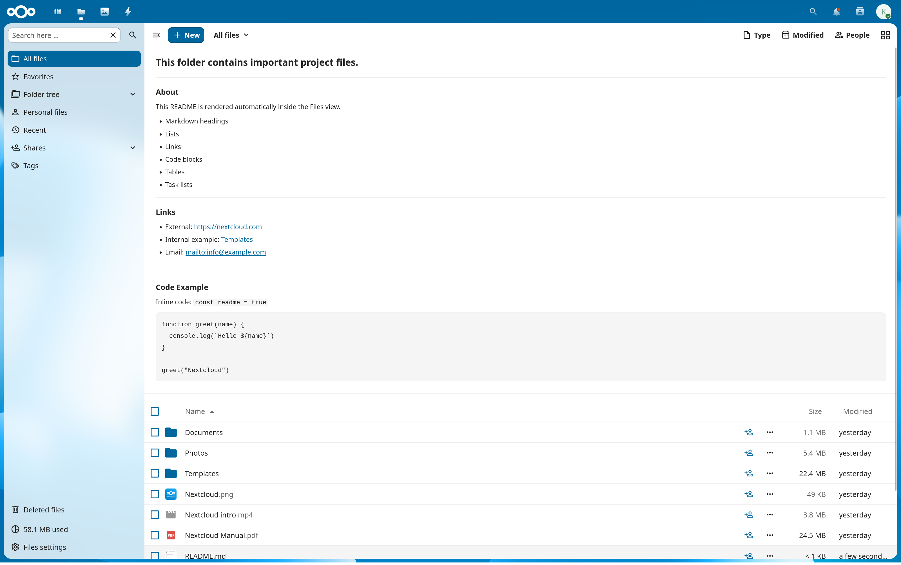

# MarkDown-renderer (Nextcloud app)

Render a folder README (`README.md`, `Readme.md`, `readme.md`, etc.) directly at the top of the Nextcloud Files view — similar to GitLab.

## Screenshot


---

## Features

* Renders Markdown inside the Files list header
* Supports common README filename variants (case-insensitive)
* Read-only task list checkboxes
* Auto-refresh on save, rename, or delete (Nextcloud event bus)
* Lightweight bundle using highlight.js core and selected languages
* UI styling aligned with Nextcloud design

---

## Compatibility

* Supported range: Nextcloud 26-34
* Verified on Nextcloud 26
* Verified during development on Nextcloud 34
* Nextcloud 27-32 are expected to work because they use the same `@nextcloud/files` 3.x generation, but were not individually verified
* Uses the Files app header API with a legacy registration fallback for the older header registration path

---

## Installation (custom_apps)

Clone into your Nextcloud `custom_apps` directory:

```bash
git clone https://github.com/Konstiu/MarkDown-renderer.git markdownreadme
```

Enable the app in Nextcloud (Settings → Apps), then build assets:

```bash
npm ci
npm run build
```

---

## Development

```bash
npm run watch
```

---

## License

This project is licensed under the AGPL-3.0 License.

---
